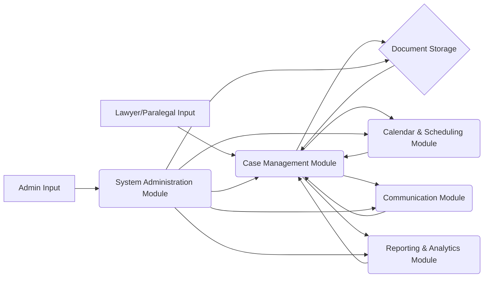

# Law Case Management SaaS Application: System Flow Documentation

This document outlines the system flows for a law case management SaaS application.

## 1. User Workflows

This section describes how different user types interact with the system.  We assume three primary user roles: Lawyer, Paralegal, and Admin.

**1.1 Lawyer Workflow:**

* **Case Creation:**  The lawyer creates a new case, entering client details, case specifics (e.g., court, opposing counsel), and initial documents.
* **Document Management:** Uploads and manages documents related to the case (e.g., pleadings, correspondence, discovery).  Can search and filter documents.
* **Calendar & Scheduling:** Schedules meetings, court dates, and deadlines.  Receives reminders.
* **Communication:** Sends and receives secure messages with clients and other parties involved.
* **Reporting & Analytics:** Generates reports on case status, time spent, and billing information.

**1.2 Paralegal Workflow:**

* **Case Assistance:** Assists the lawyer by managing documents, scheduling, and communication.  Has restricted access to sensitive client information.
* **Document Management:**  Uploads, organizes, and tags documents as instructed by the lawyer.
* **Calendar & Scheduling:**  Supports the lawyer in scheduling and managing appointments.
* **Communication:**  Manages communication with clients and other parties under the lawyer's supervision.

**1.3 Admin Workflow:**

* **User Management:** Creates, modifies, and deletes user accounts and assigns roles.
* **System Configuration:** Configures system settings, such as billing rates and reporting parameters.
* **Data Management:**  Performs backups, restores, and data cleanup tasks.
* **Monitoring & Reporting:** Monitors system performance and generates system-level reports.

## 2. Data Flows

This section outlines how data moves within the application.

**Data Flow Explanation:**

* User input (Lawyer/Paralegal) feeds into the Case Management Module, which interacts with Document Storage, Calendar & Scheduling, Communication, and Reporting & Analytics modules.  These modules provide data back to the Case Management Module.
* Admin input influences all modules through the System Administration Module.

## 3. Integration Points

This section describes how different components of the system connect.

* **Third-Party Document Storage:** Integration with cloud storage services (e.g. Google Drive) for secure document storage and version control.
* **Email Integration:**  Integration with email providers for secure messaging and communication.
* **Calendar Integration:** Integration with existing calendar systems (e.g., Google Calendar, Outlook Calendar) for seamless scheduling.
* **Payment Gateway Integration:**  Integration with a payment gateway for online billing and payment processing.

## 4. Error Handling

This section outlines how the system manages failures.

* **Input Validation:**  All user inputs are validated to prevent invalid data entry.
* **Data Integrity Checks:**  Regular data integrity checks are performed to ensure data consistency and accuracy.
* **Error Logging:**  Detailed error logs are maintained for troubleshooting and debugging.
* **Notification System:**  Users are notified of errors and system issues through email or in-app alerts.
* **Rollback Mechanisms:**  Transactions are handled with rollback capabilities to prevent data corruption in case of failures.
* **Data Backup & Recovery:** Regular data backups are performed, and a recovery plan is in place to restore data in case of data loss.

This documentation provides a high-level overview of the system flows. More detailed documentation will be provided for individual modules and components.
